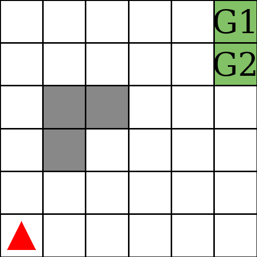

# Gym Continual Reinforcement Learning

Implementations of the environments specified in the paper "Prediction and
Control in Continual Reinforcement Learning" by Nishanth Anand and Doina Precup.



## Installation
```bash
pip install -e .
```

## References
```bibtex
@misc{anand2023prediction,
      title={Prediction and Control in Continual Reinforcement Learning},
      author={Nishanth Anand and Doina Precup},
      year={2023},
      eprint={2312.11669},
      archivePrefix={arXiv},
      primaryClass={cs.LG}
}
```
